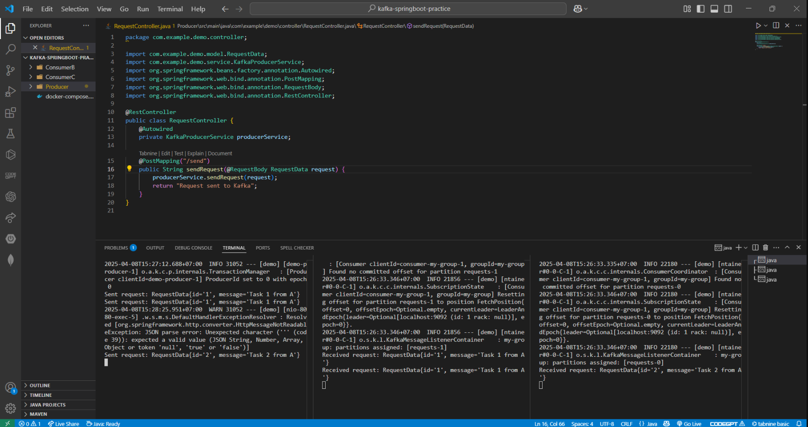

# Kafka với Spring Boot

Dự án này minh họa cách sử dụng Kafka với Spring Boot, bao gồm cấu hình Kafka Cluster và tích hợp Spring Boot để gửi/nhận tin nhắn.

---

## 1. Cấu hình Kafka Cluster với Docker Compose

### Bước 1: Tạo file `docker-compose.yml`
File `docker-compose.yml` được sử dụng để khởi tạo một Kafka Cluster với 3 Zookeeper và 3 Kafka Broker. Nội dung file đã được cung cấp trong dự án.

### Bước 2: Chạy Kafka Cluster
Sử dụng lệnh sau để khởi động Kafka Cluster:
```bash
docker-compose up -d
```
Lệnh này sẽ khởi động các container Zookeeper và Kafka Broker.


### Bước 3: Kiểm tra trạng thái
Sử dụng lệnh sau để kiểm tra trạng thái các container:
```bash
docker ps
```
Hãy đảm bảo rằng tất cả các container đều đang chạy.


---

## 2. Tạo Spring Boot Application

### Bước 1: Tạo dự án Spring Boot
- Truy cập [Spring Initializr](https://start.spring.io/).
- Chọn các thông số:
  - **Project**: Maven
  - **Language**: Java
  - **Spring Boot Version**: 2.7.x hoặc mới hơn
  - **Dependencies**: Spring Web, Spring for Apache Kafka
- Nhấn **Generate** để tải về dự án.

### Bước 2: Cấu hình Kafka trong `application.yml`
Thêm cấu hình Kafka vào file `application.yml`:
```yaml
spring:
  kafka:
    bootstrap-servers: kafka1:9092,kafka2:9093,kafka3:9094
    consumer:
      group-id: my-group
      auto-offset-reset: earliest
    producer:
      key-serializer: org.apache.kafka.common.serialization.StringSerializer
      value-serializer: org.apache.kafka.common.serialization.StringSerializer
    consumer:
      key-deserializer: org.apache.kafka.common.serialization.StringDeserializer
      value-deserializer: org.apache.kafka.common.serialization.StringDeserializer
```

### Bước 3: Tạo Producer và Consumer
- **Producer**: Tạo một service để gửi tin nhắn đến Kafka.
- **Consumer**: Tạo một listener để nhận tin nhắn từ Kafka.

Ví dụ:
```java
// Producer
@Service
public class KafkaProducer {
    private final KafkaTemplate<String, String> kafkaTemplate;

    public KafkaProducer(KafkaTemplate<String, String> kafkaTemplate) {
        this.kafkaTemplate = kafkaTemplate;
    }

    public void sendMessage(String topic, String message) {
        kafkaTemplate.send(topic, message);
    }
}

// Consumer
@Component
public class KafkaConsumer {
    @KafkaListener(topics = "my-topic", groupId = "my-group")
    public void listen(String message) {
        System.out.println("Received message: " + message);
    }
}
```

---

## 3. Chạy và kiểm tra ứng dụng

### Bước 1: Chạy ứng dụng Spring Boot
Sử dụng lệnh sau để chạy ứng dụng:
```bash
mvn spring-boot:run
```

### Bước 2: Gửi tin nhắn đến Kafka
Sử dụng API hoặc giao diện người dùng để gửi tin nhắn đến Kafka thông qua Producer.


### Bước 3: Kiểm tra tin nhắn
Kiểm tra log của ứng dụng để xem Consumer đã nhận được tin nhắn hay chưa.



---

## 4. Chạy 3 cluster trong Kafka


## 5. Tắt 1 máy Kafka đi


